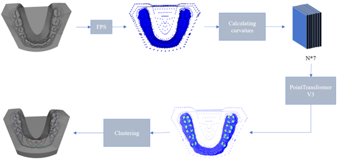

## Run Steps

1. You should first run the code in the `create_train_val_data` directory. Put the data in the `/Pointcept/data/teeth_land` directory.
2. Configure the environment according to the `Dockerfile`
3. Run `sh Pointcept/scripts/train.sh -g 4 -d teeth_land -c semseg-pt-v3m1-0-base -n semseg-pt-v3m1-0-base` to train the model.
4. After training the model, if you already have test data directly run `sh Pointcept/scripts/test.sh -g 1 -d teeth_land -c semseg-pt-v3m1-0-base -n semseg-pt-v3m1-0-base` to test the results. If you don't have it, you can just run `process.py` to process the input mesh data to construct the test data and auto-complete the test.

## Preprocess Steps

To acquire the data necessary for network training, we first sampled the existing dental models. Specifically, we sampled 16384 points from each model to generate the corresponding point cloud data. This point cloud data includes both coordinate and normal information, allowing us to compute the curvature of each point. Additionally, we calculated the Euclidean distance field between each type of landmark feature and the corresponding tooth, resulting in a $16384 × 1$ dimensional output. Subsequently, we supervise the network training by converting the distance of each point into an associated confidence level, as the following equation. In this equation, $C(d)$ represents the confidence level, $d$ is the Euclidean distance, and $k$ is a scaling factor that controls the rate of confidence decay, which we set to $k=0.25$. This formulation allows for a smooth transition of confidence values, where greater distances correspond to lower confidence levels.

$$
C(d)=e^{-k\cdot d}
$$

## Network Architecture

Based on preprocessing data, we input it into the network, which predicts the confidence levels for various landmark categories. The output dimension is $16384×6$, where $6$ represents the number of feature point categories and $16384$ denotes the number of points.

## Loss Function

We employ the Mean Squared Error (MSE) loss function.

## Post-processing steps

After obtaining the confidence levels for each landmark category, we first filter out landmarks with confidence values below $0.7$, considering these to be irrelevant. The remaining landmarks are then processed using a density-based clustering algorithm, which enables us to identify multiple clusters. Each cluster corresponds to the landmark regions located on different teeth. Subsequently, for each cluster, we select the landmark with the highest confidence level as the final landmark. This approach not only facilitates rapid landmark prediction but also enhances the accuracy of landmark detection, ensuring the stability and reliability of the identified landmarks for subsequent analysis and applications in dental diagnostics.
